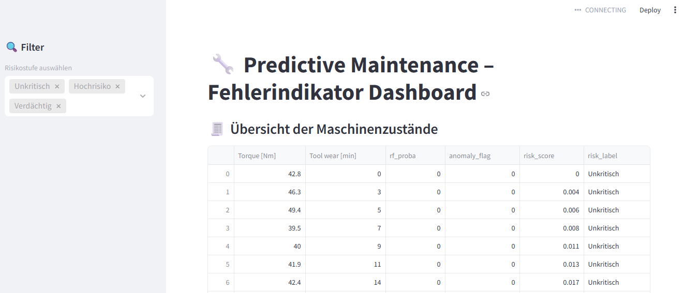

# Predictive-Maintenance-Light

Demo für Fräsmaschinen-Fehlererkennung mit kombiniertem Risikoscore aus Random Forest, Isolation Forest und Tool Wear.

[](https://predictive-maintenance-light.streamlit.app/)
[](LICENSE)
[](https://www.python.org/)

## Live-Demo

Die App läuft auf Streamlit Cloud:
**https://predictive-maintenance-light.streamlit.app/**



## Datensatz

Trainings- und Demodaten kommen aus dem [AI4I 2020 Predictive Maintenance Dataset](https://archive.ics.uci.edu/dataset/601/ai4i+2020+predictive+maintenance+dataset) (UCI ML Repository). 10.000 simulierte Datenpunkte einer Fräsmaschine mit folgenden Feldern:

- **Air Temperature [K]** — Umgebungstemperatur
- **Process Temperature [K]** — Prozesstemperatur
- **Rotational Speed [rpm]** — Drehzahl
- **Torque [Nm]** — Drehmoment
- **Tool Wear [min]** — Werkzeug-Standzeit in Minuten
- **Type** — Maschinenklasse L / M / H
- **Machine failure** — Binäres Failure-Label
- **TWF / HDF / PWF / OSF / RNF** — fünf Failure-Subtypen (Tool Wear, Heat Dissipation, Power, Overstrain, Random)

Failure-Anteil im Datensatz: rund 3,4 %.

## Methodik

Die App kombiniert drei Signale zu einem aggregierten Risikoscore:

### Klassifikation (Random Forest)
Vorhersage der Wahrscheinlichkeit eines Maschinenausfalls aus Drehmoment, Tool Wear, Drehzahl, Prozesstemperatur und Maschinentyp. 100 Bäume, fester Random State.

### Anomalie-Erkennung (Isolation Forest)
Markiert Betriebszustände, die im Feature-Raum vom Normalbetrieb abweichen — auch ohne Failure-Label. `contamination=0.01`, also rund ein Prozent Anomalien werden erwartet.

### Tool Wear
Werkzeugverschleiß fließt zusätzlich als kontinuierlicher Faktor ein, min-max-skaliert auf [0, 1]. So wird Verschleißrisiko unabhängig von der RF-Vorhersage abgebildet.

### Kombinierter Risikoscore
Gewichtete Aggregation der drei Signale:

```
risk_score = 0.5 · rf_proba + 0.3 · tool_wear_scaled + 0.2 · anomaly_flag
```

Daraus drei Stufen:

| Score | Stufe |
|---|---|
| < 0,3 | Unkritisch |
| 0,3 – 0,6 | Verdächtig |
| ≥ 0,6 | Hochrisiko |

## Was die App im UI bietet

Zwei Tabs strukturieren das Dashboard:

**Tab "Simulation" — manuelle Risikobewertung**

- Sensorwerte eingeben: Drehmoment, Tool Wear, Drehzahl, Prozesstemperatur, Maschinentyp
- Sofortige Ausgabe: Risikostufe als farbig hervorgehobener Header plus vier Metriken (Score, RF-Wahrscheinlichkeit, Tool Wear skaliert, Anomalie-Flag)

**Tab "Datenbasis" — Exploration des AI4I-Datensatzes**

- Filter nach Risikostufe (Unkritisch, Verdächtig, Hochrisiko)
- Vier Kennzahlen-Kacheln über die gefilterte Auswahl
- Verteilungsdiagramm der Risikostufen
- Tabelle mit RF-Wahrscheinlichkeit, Anomalie-Flag, Tool Wear, Score und Label je Datenpunkt
- CSV-Export der gefilterten Ansicht

Die Sidebar fasst Datensatzgröße und eingesetzte Modelle zusammen. Dark Theme mit semantischen Risikostufen-Farben (grün, orange, rot).

## Ergebnisse

Aus dem Notebook `04_classification_machine_failure.ipynb` (25 % Holdout, stratifiziert):

**Random Forest — Maschinenausfall (binär)**

| Metrik | Klasse 0 (kein Ausfall) | Klasse 1 (Ausfall) |
|---|---|---|
| Precision | 0,98 | 0,82 |
| Recall | 1,00 | 0,36 |
| F1 | 0,99 | 0,50 |
| Support | 2 415 | 85 |

- Accuracy gesamt: **0,98**
- Macro-F1: **0,75**

Die hohe Accuracy ist bei diesem Klassen-Verhältnis (97/3) trügerisch. Der Recall für die Failure-Klasse liegt bei 0,36 — das Modell verpasst zwei von drei echten Ausfällen. Genau deshalb der kombinierte Score: Isolation Forest und Tool Wear fangen Fälle ab, die der Random Forest übersieht.

**Isolation Forest — Vergleich aus `02_isolation_forest_featurevergleich.ipynb`**

Bei `contamination=0.01` (≈100 markierte Anomalien je 10 000 Samples) sind 35 – 37 davon echte Failures, je nach Feature-Set. Klassische Anomalie-Erkennung also: nicht präzise, aber komplementär zur überwachten Klassifikation.

## Tech-Stack


## Setup

```bash
git clone https://github.com/philhap/predictive-maintenance-light.git
cd predictive-maintenance-light
python -m venv venv
# Windows:
venv\Scripts\activate
# macOS/Linux:
source venv/bin/activate

pip install -r requirements.txt
streamlit run app.py
```

### Modelle neu trainieren

```bash
python src/train_model.py
```

Schreibt `models/model_rf.pkl` und `models/model_iso.pkl`.

### Batch-Vorhersage über CSV

```bash
python src/predict_from_file.py
```

Liest `data/prediction-data.csv` und schreibt `data/predictions.csv` mit Risiko-Score und Label.

## Projektstruktur

```
predictive-maintenance-light/
├── app.py                          Streamlit-App
├── data/
│   ├── ai4i2020.csv                Originaldatensatz
│   ├── detected_anomalies.csv      Isolation-Forest-Output
│   ├── prediction-data.csv         Eingabe für Batch-Predict
│   └── predictions.csv             Ergebnisse Batch-Predict
├── models/
│   ├── model_rf.pkl                Random Forest
│   └── model_iso.pkl               Isolation Forest
├── notebooks/                      Explorative Analyse + Modellierung
│   ├── 01_data_exploration.ipynb
│   ├── 02_isolation_forest_featurevergleich.ipynb
│   ├── 03_3d_visualisierung.ipynb
│   ├── 04_classification_machine_failure.ipynb
│   ├── 05_classification_expanded.ipynb
│   ├── 06_multilabel_failuretypes.ipynb
│   └── 07_fehlerindikator.ipynb
├── src/
│   ├── predict_from_file.py
│   ├── train_model.py
│   └── utils.py
├── docs/                           Screenshots
├── requirements.txt
├── LICENSE
└── README.md
```

## Lessons Learned

- **Eine einzelne Metrik reicht nicht.** 98 % Accuracy klingen gut, bis man auf den Recall der Minderheitsklasse schaut. Bei Failure-Anteilen unter 5 % sagt Accuracy fast nichts aus.
- **Komplementäre Modelle schlagen ein perfektes Einzelmodell.** Random Forest ist präzise, aber blind für seltene Muster. Isolation Forest ist unscharf, fängt aber genau die Fälle ab. Die Kombination kostet kaum Komplexität und liefert ein robusteres Signal als jedes Modell allein.
- **Domänenwissen schlägt reine Statistik.** Tool Wear als linearen Faktor einzubauen statt es nur als Feature im RF zu lassen, hat den Score interpretierbar gemacht — Anwender sehen, warum eine Maschine als kritisch eingestuft wird.
- **Gewichtung ist eine Designentscheidung, kein Hyperparameter.** Die 0.5 / 0.3 / 0.2 sind nicht trainiert, sondern gesetzt. In einem Production-Setting müsste man die Gewichte gegen Kosten von False Positives und False Negatives kalibrieren — Stillstand vs. übersehener Defekt.
- **Streamlit eignet sich für ML-Demos, nicht für Production.** Für Deployment hinter einer echten Anlagen-Steuerung bräuchte es eine API mit klarem Versionsmanagement der Modelle, Monitoring der Eingangsverteilungen und ein Retraining-Pipeline. Diese App zeigt das Konzept — nicht den Production-Stack.

## Disclaimer

Demo auf öffentlichem, simuliertem Datensatz (AI4I 2020). Keine Production-Garantie. Echte Predictive-Maintenance-Systeme brauchen domänenspezifische Validierung, Drift-Monitoring und sauber kalibrierte Schwellwerte für die jeweilige Anlage.

Beim ersten Aufruf braucht die Streamlit-Cloud-Demo eventuell 30 Sekunden zum Hochfahren, wenn die App eine Weile inaktiv war.

## Autor

**Philipp Heppler** — zertifizierter Data Scientist, Fokus auf praxisnahe ML-Anwendungen für Industrie und Mittelstand.

Weitere Projekte:
- [DS-Projektarbeit-Philipp-Heppler-Bike-Sharing](https://github.com/philhap/DS-Projektarbeit-Philipp-Heppler-Bike-Sharing) — Regressionsanalyse zur Nachfrageprognose im Bike-Sharing

## Lizenz

[MIT](LICENSE)
